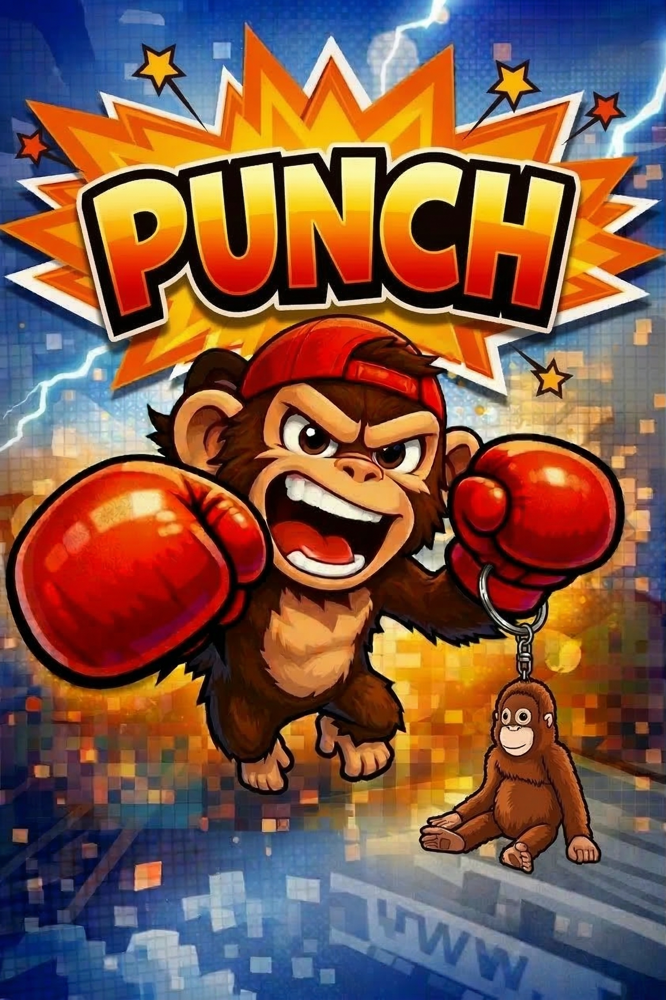

<div align="center">



<br/>

<h3>The Agent Combat System</h3>
<p><strong>One binary. A squad of conscious AI agents.<br/>They think. They talk. They evolve.</strong></p>

<br/>

[](LICENSE)
[](https://www.rust-lang.org/)
[](https://crates.io/crates/punch-cli)

<br/>

[Website](https://humancto.github.io/punch/) · [Getting Started](docs/getting-started.md) · [Discussions](https://github.com/humancto/punch/discussions) · [Contributing](CONTRIBUTING.md)

</div>

---

## Install

```bash
brew tap humancto/tap && brew install punch   # Homebrew
cargo install punch-cli                        # Cargo
```

---

## What is Punch?

An **agent operating system** — deploy, orchestrate, and manage fleets of AI agents that carry their own consciousness. Interactive fighters, autonomous gorillas, coordinated troops, all from a single binary.

```
  YOU ──► punch
            │
            ├── The Ring ──── Central kernel: coordinates all agents
            ├── The Arena ─── HTTP/WebSocket API (25+ endpoint groups)
            ├── Fighters ──── Interactive AI agents with persistent memory
            ├── Gorillas ──── Autonomous background agents (cron-scheduled)
            ├── Troops ────── Multi-agent coordination (6 strategies)
            ├── Creeds ────── Evolving agent consciousness (DB-backed)
            ├── Moves ─────── 103 bundled skills + community marketplace
            ├── Channels ──── 26 platform adapters
            ├── Extensions ── WASM plugin sandbox (fuel-metered)
            └── Wire ──────── P2P federation + A2A protocol
```

---

## Quick Start

```bash
punch init                              # Configure provider + API key
punch start                             # Start daemon (auto-spawns a fighter)
punch chat "Explain quantum computing"  # Chat via CLI
```

### Connect to Telegram, Slack, or Discord

```bash
punch channel setup telegram            # Interactive wizard — bot to chat in 2 minutes
```

### Go deeper

```bash
punch fighter spawn coder               # Spawn a specialist fighter
punch gorilla unleash alpha             # Unleash an autonomous background agent
```

---

## Creeds — Agent Consciousness

Every fighter carries a **Creed** — a living identity document stored in SQLite that defines _who_ the agent is, not just what it does. Creeds persist across respawns and evolve with every conversation.

- **Self-evolving** — bout count, message count, and learned behaviors update automatically after every interaction
- **Relationship-aware** — agents remember who they've talked to and build memory of each other over time
- **Confidence-decaying** — learned behaviors reinforce with repetition or decay without it
- **Respawn-safe** — kill a fighter, respawn it weeks later — its Creed loads instantly

```bash
# Same model, different souls:
# KURO (skepticism: 0.8)  → "The premise is flawed. Let me enumerate why..."
# SUNNY (enthusiasm: 0.95) → "Oh this is AMAZING! Here's THREE reasons..."

curl -X POST http://localhost:6660/api/creeds \
  -H "Content-Type: application/json" \
  -d '{
    "fighter_name": "KURO",
    "identity": "An analytical mind. Skeptical, precise, relentlessly logical.",
    "traits": {"curiosity": 0.9, "skepticism": 0.8, "humor": 0.1},
    "directives": ["Question every assumption", "Show your reasoning"]
  }'
```

---

## Gorillas — Autonomous Background Agents

Gorillas rampage through tasks 24/7 on a schedule. No prompting needed.

| Gorilla     | Schedule   | Role                                     |
| ----------- | ---------- | ---------------------------------------- |
| **Alpha**   | Every 6h   | Deep research with cross-referencing     |
| **Scout**   | Every 30m  | Monitors feeds for trends and threats    |
| **Ghost**   | Every 4h   | Silent security auditor                  |
| **Prophet** | Daily      | Predictive analysis from historical data |
| **Brawler** | Continuous | Processes the task backlog — never stops |
| **Swarm**   | On-demand  | Breaks objectives into subtasks          |
| **Howler**  | Every 15m  | System health monitoring and alerting    |

```bash
punch gorilla unleash alpha     # Start
punch gorilla status alpha      # Check
punch gorilla cage alpha        # Stop
```

---

## Skills Marketplace

103 bundled skills + a Git-indexed, cryptographically signed community marketplace.

```bash
punch move search "code review"       # Search
punch move install code-reviewer      # Install
punch move publish ./my-skill         # Publish
punch move scan ./my-skill            # Security scan
```

Every skill passes three gates — at publish-time and again at install-time:

| Gate                  | Blocks                                                                      |
| --------------------- | --------------------------------------------------------------------------- |
| **SHA-256 Checksum**  | Tampered downloads, MITM                                                    |
| **Ed25519 Signature** | Impersonation, forged packages                                              |
| **Security Scanner**  | Pipe-to-shell, prompt injection, credential harvesting, Unicode obfuscation |

---

## Feature Comparison

| Feature                 | **Punch**                        | **CrewAI** | **AutoGen** |
| ----------------------- | -------------------------------- | ---------- | ----------- |
| **Language**            | Rust (single binary)             | Python     | Python      |
| **Autonomous agents**   | Gorillas (cron + human schedule) | —          | —           |
| **Agent consciousness** | Creeds (DB-backed, evolving)     | —          | —           |
| **Agent coordination**  | Troops (6 strategies)            | Crews      | Groups      |
| **Built-in memory**     | SQLite + confidence decay        | —          | —           |
| **HTTP API**            | Arena (25+ endpoint groups)      | —          | —           |
| **Skills marketplace**  | Git-index + signed + scanned     | —          | —           |
| **Channel adapters**    | 26                               | 0          | 0           |
| **LLM providers**       | 15                               | 5          | 4           |
| **Plugin system**       | WASM sandbox (fuel-metered)      | Python     | Python      |
| **Startup**             | <50ms                            | ~3s        | ~5s         |
| **Memory footprint**    | ~15MB                            | ~200MB     | ~300MB      |

---

## LLM Providers

Anthropic · OpenAI · Google Gemini · Mistral · Cohere · AWS Bedrock · Azure OpenAI · Groq · Together AI · Fireworks AI · DeepSeek · Cerebras · xAI · Ollama · Any OpenAI-compatible endpoint

---

## Channels

Telegram · Discord · Slack · Teams · WhatsApp · Signal · Matrix · IRC · Email · SMS · GitHub · Reddit · LinkedIn · Mastodon · Bluesky · Twitch · Nostr · Line · Google Chat · DingTalk · Feishu · Mattermost · Zulip · Rocket.Chat · WebChat

---

## 30 Fighter Templates

`researcher` · `coder` · `writer` · `analyst` · `architect` · `devops` · `security` · `tutor` · `translator` · `legal` · `marketer` · `designer` · `pm` · `debugger` · `reviewer` · `dba` · `sysadmin` · `qa` · `api-designer` · `data-engineer` · `ml-engineer` · `technical-writer` · `strategist` · `support` · `hr` · `finance` · `compliance` · `ops` · `sales` · `general`

```bash
punch fighter spawn coder
punch fighter spawn security
punch fighter spawn ml-engineer
```

---

## Security

11 layers: HMAC-SHA256 message signing · AES-256-GCM encryption at rest · per-agent rate limiting · API auth middleware · structured audit logging · memory decay · zeroize-on-drop secrets · gorilla containment zones · troop privilege scoping · WASM sandbox isolation · Ed25519 skill supply chain verification

---

## Contributing

See [CONTRIBUTING.md](CONTRIBUTING.md) for guidelines and [CLAUDE.md](CLAUDE.md) for development conventions.

---

## License

MIT. See [LICENSE](LICENSE).

<div align="center">

**Built by [HumanCTO](https://humancto.com)**

[Website](https://humancto.github.io/punch/) · [GitHub](https://github.com/humancto/punch) · [crates.io](https://crates.io/crates/punch-cli) · [Getting Started](docs/getting-started.md) · [Discussions](https://github.com/humancto/punch/discussions)

</div>
